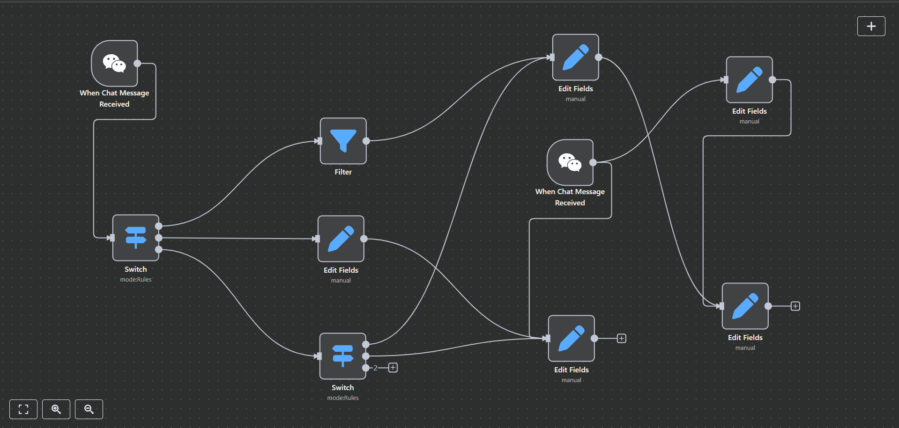

# dotFlow ➡️ Node-Edge Flow Editor
A fully dynamic **graph-based visual editor** to create, connect, and manage **nodes and edges**, with **smooth zoom**, **pan**, **group selection**, **snapping**, and **dynamic edge shaping**.
Built using **SolidJS** + **TypeScript**. **solidJS** reactive framework like **React** 

## 🚀 Features

### 🧩 Node and Edge System
- Create nodes with **dynamic input/output ports**.
- Extend nodes with **custom JSX content** (e.g., buttons inside nodes).
- Draw **dynamic edges** that **change shape** based on node distance:
  - Smooth curves for far nodes.
  - Logical L-shaped paths for close nodes.
- Smart edge handling for **new vs existing edges**.

### 🖱️ Full Dragging and Panning
- **Single node dragging** with cursor-stick behavior.
- **Multiple node group dragging** using a selection box.
- **Board auto-pans** when dragging near screen edges.

### 📦 Group Selection
- **Drag to select** multiple nodes.
- **Bounding box** appears around selected nodes.
- **Move group** together with correct edge handling.
- Group dragging **auto-pans** the board when reaching edges.

### 🧲 Intelligent Edge Creation
- Drag output ports to **create edges**.
- **Snap to nearest input** automatically within threshold distance.
- **Zoom/pan independent snapping** for accuracy.

### 🔍 Intuitive Zoom and Pan
- **Zoom In/Out** with Ctrl/Space + Mouse Wheel.
- **Cursor-centered zoom** for natural behavior.
- **Pan** the board using Ctrl/Space + Mouse Drag.
- **Zoom Controls**: Zoom In, Zoom Out, Reset Zoom, Zoom to Fit.

### ✂️ Deletion
- Delete nodes and edges individually.
- Multi-select delete with selection box.

### ➕ Smart Node Insertion
- Add new nodes:
  - Near selected nodes.
  - Near pending output connections.
  - At the last click position.

### 🎨 Visual Features
- Dynamic **arrowhead edges**.
- **Selection box** with translucent styling.
- **Dotted background** that moves/zooms smoothly.
  
## Usage
**Usage is restricted under an NDA (Non-Disclosure Agreement).**
